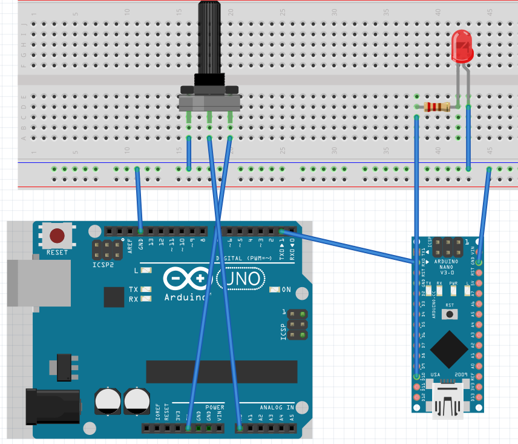

# UART-Based LED Control with Arduino

This project demonstrates serial communication (UART) between two Arduino boards to control the brightness of an LED using `analogWrite()` and PWM. One board transmits brightness values over serial, and the other applies them to an LED.

---

## Features

- One-way UART communication
- PWM-based brightness control
- Clean and minimal hardware setup
- Modular and easy-to-read code

---

## Technologies Used

- Arduino UNO & Nano
- C/C++ (Arduino Sketch)
- UART Protocol
- PWM (Pulse Width Modulation)

---

## Hardware Setup

**Connections:**



---

## Getting Started

### Requirements

- Arduino IDE
- Two Arduino boards (Uno & Nano)
- USB cables for each board

### Installation

1. Clone the repository: git clone https://github.com/alpertemizel/arduino-uart-led-control.git

2. Open each `.ino` file in Arduino IDE and upload:
- Upload `uno_sender.ino` to the Uno
- Upload `nano_receiver.ino` to the Nano

3. Connect TX → RX and GND → GND

---

## Usage

Once both boards are powered:
- The Uno sends brightness values from 0 to 255.
- The Nano receives them and adjusts the LED brightness accordingly.

---

**Uno Sender:**

```cpp
void setup() {
  // put your setup code here, to run once:
  Serial.begin(9600);

 
}

void loop() {
  // put your main code here, to run repeatedly:
  unsigned int analogValue = analogRead(A0);
  Serial.println(map(analogValue,0,1023,0,255));
  }
}
```

**Uno Receiver:**

```cpp
void setup() {
  // put your setup code here, to run once:
  Serial.begin(9600);

 
}

void loop() {
  // put your main code here, to run repeatedly:
  if(Serial.available()){
    analogWrite(10, Serial.read());
  }
}
```

**Important:** Do not connect TX/RX pins during upload. Upload the code first, then connect the UART pins.

## Common Issues and Fixes

**Problem:** Upload fails when both boards are connected  
**Solution:** Upload code one by one. Only connect one Arduino at a time.

**Problem:** Upload fails when TX/RX are connected  
**Solution:** Disconnect TX/RX before uploading. Reconnect after upload.

## What I Learned

- How to set up UART communication between two Arduinos  
- Handling Serial data with `Serial.read()`  
- Importance of TX/RX timing during uploading

## License

This project is licensed under the MIT License.


